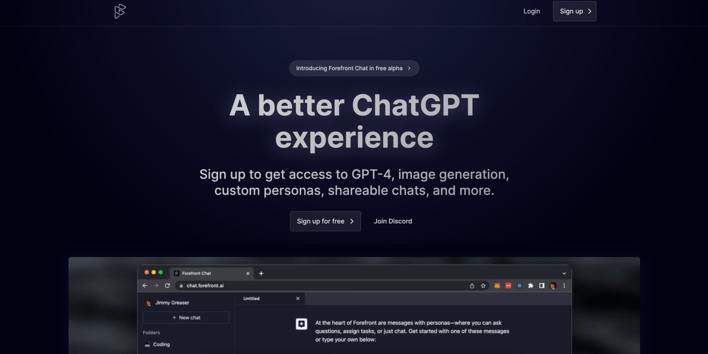
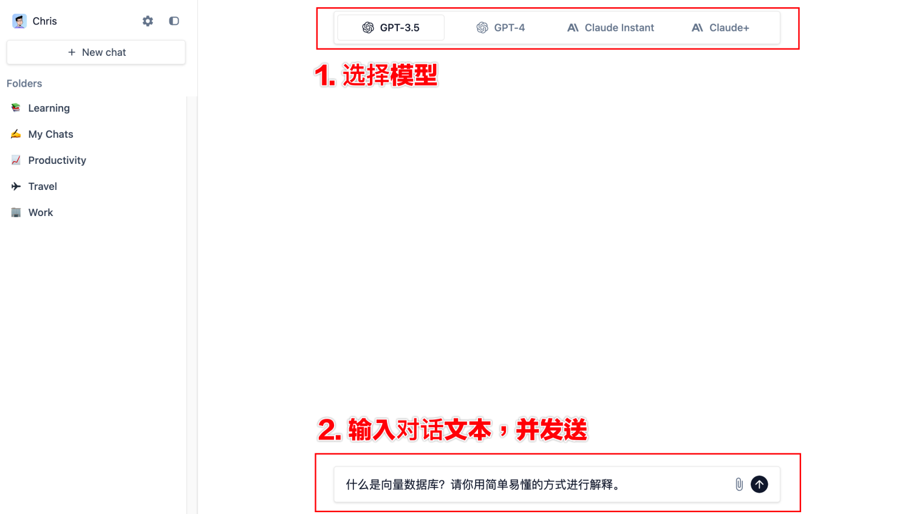
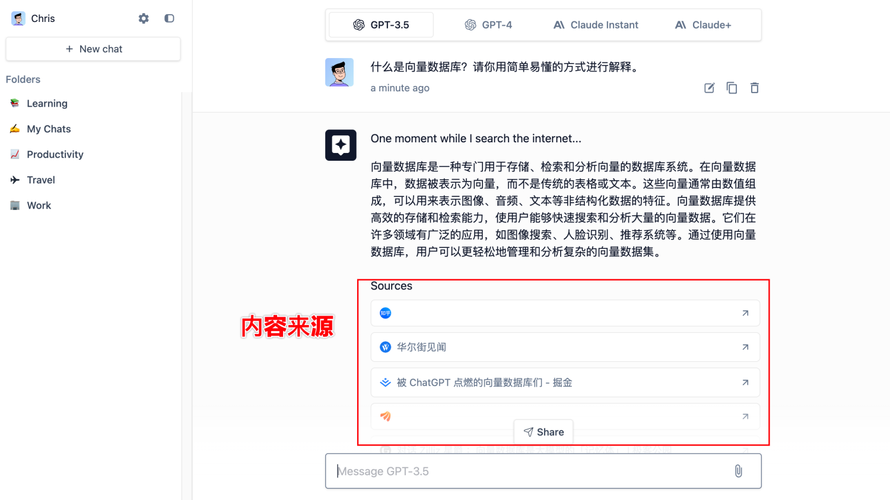
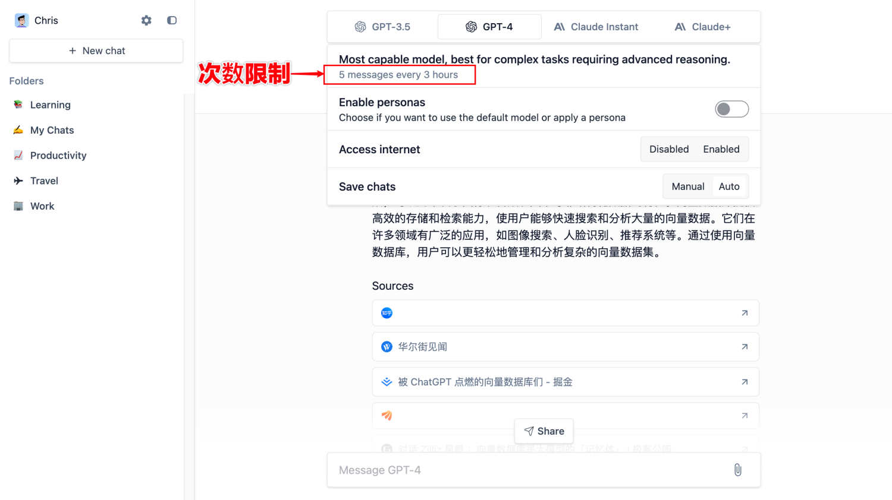
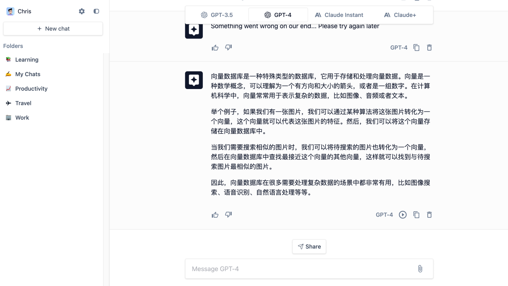
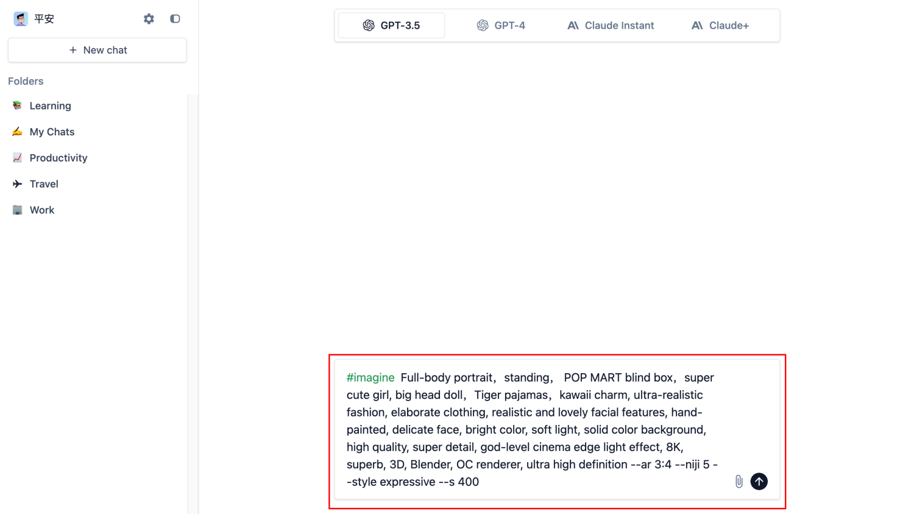
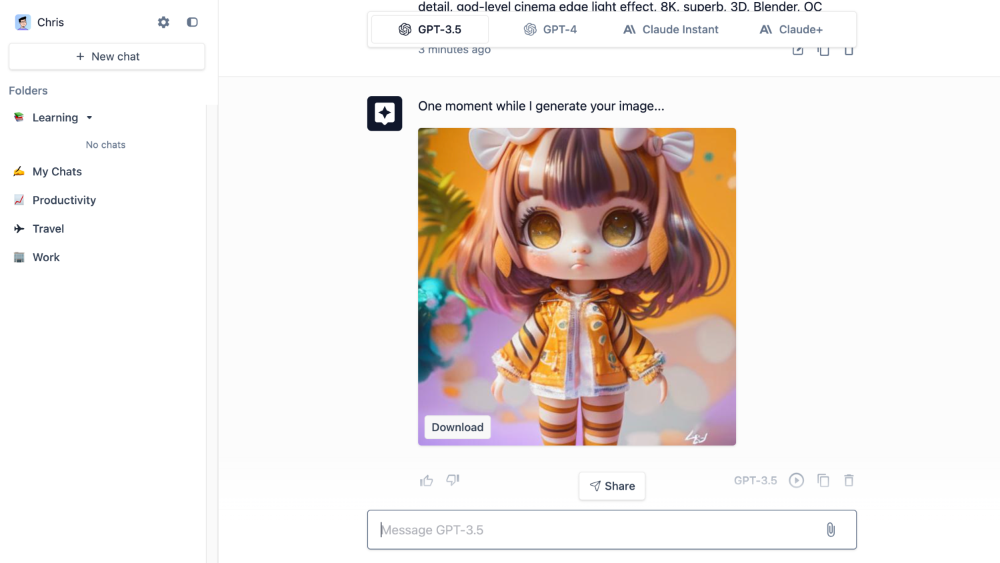
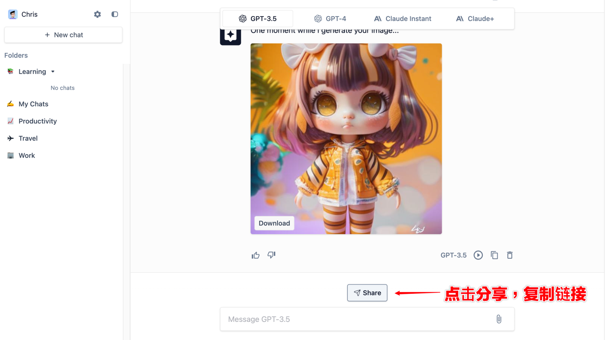
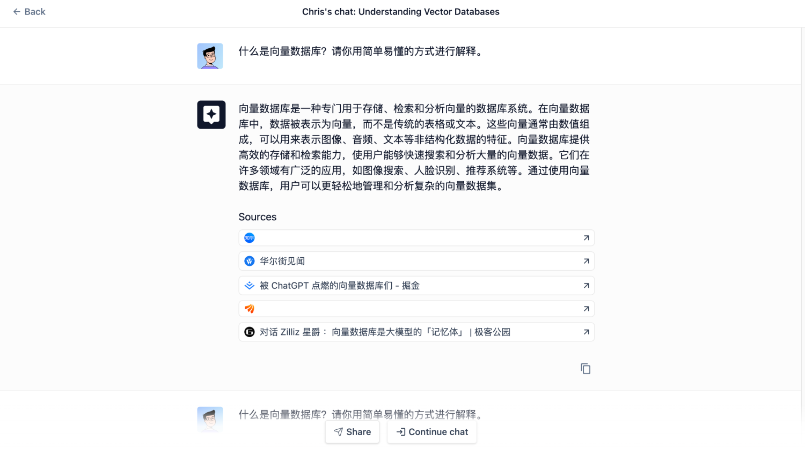
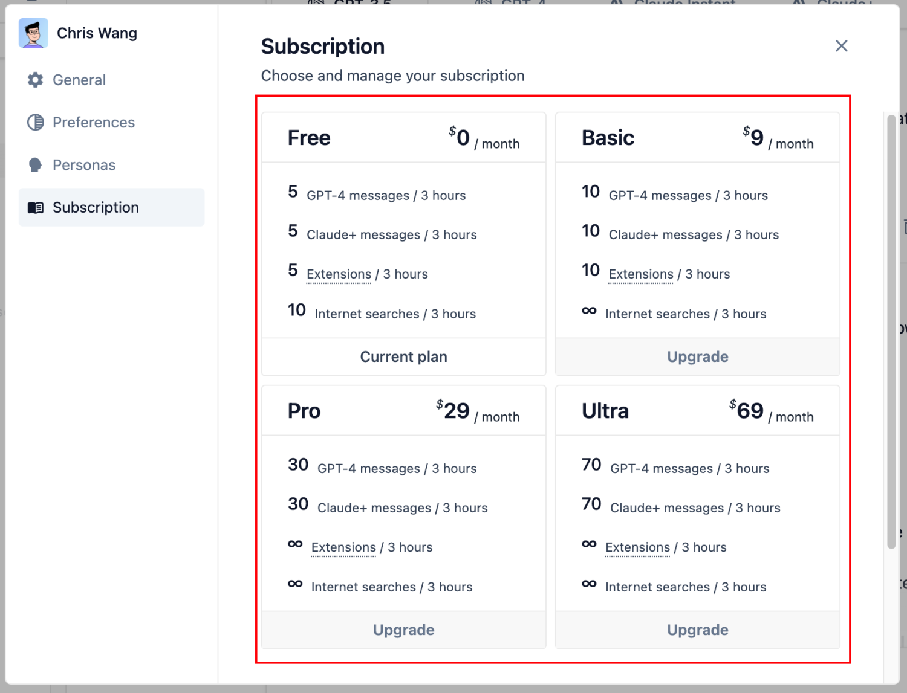

今天 Chris 给大家推荐的工具是 Forefront AI，一款可以免费使用 GPT-4 的在线工具，快来一起看看吧。

> 工具地址：[https://www.forefront.ai/](https://www.forefront.ai/)

## 一、工具介绍

Forefront Chat 是一款免费的 AI 在线**聊天机器人**，支持多种主流模型，如 GPT-3.5、GPT-4、Claude Instant 和 Claude+。此外，它还提供**图像生成**、**自定义角色**和**共享聊天**等功能。用户可以创建多个**具有独特个性和能力的机器人**作为虚拟助手，并根据需求和任务选择不同的角色进行对话聊天。

## 二、快速使用

> Chris 提醒：GPT-4 和 Claude+ 模型免费次数为每 3 个小时 5 条消息，后面将详细介绍相关信息。

Forefront Chat 的使用非常简单，只需两个步骤即可：选择模型和输入对话文本。

然后 Forefront Chat 就会开始回复内容，并附带这些内容的来源链接，你可以点击链接进一步了解相关信息：

## 三、核心功能

### 1.访问 GPT-4

如果需要访问 GPT-4，只要选择顶部 GPT-4 模型即可。当我们鼠标放在上面，可以看到弹框显示 GPT-4 使用次数的限制，每 3 小时限制 5 条消息。

我们使用相同问题，再次提问 GPT-4，看到结果：

回复的内容比 GPT-3.5 完整一些了。

### 2. 图像生成

如果需要使用 Forefront Chat 图片生成功能，可以在输入框中输入“**#imagine**”，然后输入图片描述内容。就跟使用 Midjourney 一样。

然后可以看到生成的图片，还可以直接下载：

### 3. 自定义角色

该功能截止 Chris 写这篇文章的时候，在 Forefront Chat 已经找不到入口，不知道是不是下架了，毕竟在前两天 Chris 体验的时候，还能正常使用，并且挺有意思的。
大致就是用户可以创建不同角色的机器人，在跟这个机器人对话时，机器人会自动以**该角色去调用模型**。
比如 Chris 创建了一个“资深软件工程师”，则我在跟它对话时，它会以类似下面这样的 Prompt 发送给 AI 模型：

> 假如你是一位资深软件工程师，我接下来问你的问题，你都以这个角色的角度进行回复 .......

其实就类似一些 ChatGPT Prompt 插件，在发送内容的时候自动添加选择的角色。这可以说是大大简化了用户操作。

### 4. 共享聊天

Forefront Chat 允许用户通过点击当前会话列表下方的“**Share**”按钮，将会话列表生成一个分享链接，并自动复制链接。

其他人打开链接后，可以看到完整的会话内容，并且可以点击“**Continue chat**”继续当前会话内容：

## 四、收费情况

Forefront Chat 收费情况大概如下：

Chris 觉得 Forefront Chat 对于 GPT-4 和 Claude+ 的 3 小时限制 5 条消息还算可以，如果是对于没有 GPT-3.5 和 Claude Instant 账号的用户来说，还是非常方便的。

## 五、总结

Forefront Chat 是一款免费的 AI 在线聊天机器人，支持多种模型，包括 GPT-3.5、GPT-4、Claude Instant 和 Claude+。它还提供图像生成、自定义角色、共享聊天等功能。界面交互也很好，Chris 推荐给大家使用。
